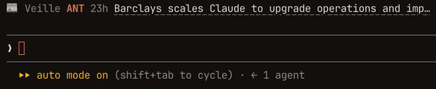

# Flash veille

Le flash info du dev, au-dessus du prompt de [Claude Code](https://code.claude.com).

Pendant que vous codez, une ligne discrète fait défiler les actus fraîches de la tech francophone et des labos d'IA, une à la fois :



Chaque titre mène là où l'actu a été partagée : la page de l'actu sur Human Coders News ou sur le Journal du hacker, et pour la veille de Camille Roux, son post sur Bluesky.

> Flash veille est un *mod* Claude Code (un plugin à hooks de fonction) : il demande **Claude Code 2.1.287 ou plus récent**. L'API des mods est en accès anticipé et peut encore changer.

## Installation

```
/plugin marketplace add camilleroux/flash-veille
/plugin install flash-veille@flash-veille
```

Le bandeau apparaît au-dessus du prompt dès la session suivante.

## Commandes

| Commande | Effet |
| --- | --- |
| `/veille` | Affiche le bandeau et rafraîchit les actus |
| `/veille tout` | Ouvre la liste complète dans un panneau, filtrable par source |
| `/veille off` | Masque le bandeau (et le panneau) ; mémorisé d'une session à l'autre |
| `/veille sources` | Liste les sources suivies |
| `/veille ajouter <site>` | Suit un autre site : `/veille ajouter korben.info` trouve son flux tout seul |
| `/veille retirer <code>` | Ne plus suivre un site ajouté avec `/veille ajouter`, désigné par le code à 3 lettres que donne `/veille sources` : `/veille retirer kor` pour Korben |

Le bandeau se replie aussi avec `ctrl+x ctrl+a`.

## Options

Dans `/config`, sous **flash-veille** :

| Option | Par défaut | Effet |
| --- | --- | --- |
| Sources | `hc, jdh, camille, linuxfr, anthropic, claudedev, claudecode` | Les sources intégrées à suivre |
| Rotation (secondes) | `12` | Durée d'affichage de chaque actu |
| Mots-clés | *(vide)* | Ex. `IA, Rails, sécurité` : les actus qui en parlent passent en premier, marquées ★ (casse et accents ignorés) |
| Seulement les mots-clés | non | N'affiche que ces actus |

## Sources intégrées

| Code | Source | Par défaut |
| --- | --- | :-: |
| `hc` | [Human Coders News](https://news.humancoders.com) | ✓ |
| `jdh` | [Journal du hacker](https://www.journalduhacker.net) | ✓ |
| `camille` | [La veille de Camille Roux](https://www.camilleroux.com/veille/), publiée sur Bluesky | ✓ |
| `linuxfr` | [Dépêches LinuxFr.org](https://linuxfr.org) | ✓ |
| `anthropic` | [Anthropic News](https://www.anthropic.com/news) ¹ | ✓ |
| `claudedev` | [Blog claude.dev](https://claude.dev) | ✓ |
| `claudecode` | [Releases de Claude Code](https://github.com/anthropics/claude-code/releases) | ✓ |
| `korben` | [Korben](https://korben.info) | |
| `openai` | [OpenAI News](https://openai.com/news/) | |
| `deepmind` | [Google DeepMind](https://deepmind.google/discover/blog/) | |
| `huggingface` | [Hugging Face](https://huggingface.co/blog) | |
| `simonw` | [Simon Willison](https://simonwillison.net) | |

¹ anthropic.com n'a pas de flux RSS officiel : Flash veille lit le miroir communautaire [Olshansk/rss-feeds](https://github.com/Olshansk/rss-feeds).

## Respect des sites sources

Les flux sont récupérés au plus tous les quarts d'heure, et ce cache est partagé entre toutes vos sessions Claude Code : ouvrir dix sessions ne fait pas dix fois plus de requêtes. Chaque requête s'annonce avec un `User-Agent` qui renvoie vers ce dépôt.

## Développement

```
claude plugin validate plugins/flash-veille
claude plugin test plugins/flash-veille
```

Pour essayer vos modifications : `claude --plugin-dir plugins/flash-veille`.

## Licence

[MIT](LICENSE), par [Camille Roux](https://www.camilleroux.com).
